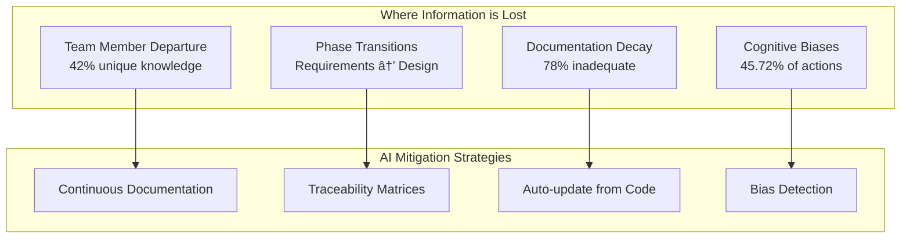

# SDLC Information Architecture Diagrams

## 1. Information Architecture Layers

## 2. Document Type Mapping to Processes

## 3. Human-AI Contribution by Process

## 4. Information Flow Through SDLC

```mermaid
stateDiagram-v2
    [*] --> Stakeholder_Needs
    
    Stakeholder_Needs --> Requirements: Human Understanding
    Requirements --> Architecture: Human Decisions + AI Docs
    Architecture --> Design: Human Trade-offs
    Design --> Implementation: 50/50 Human/AI
    Implementation --> Testing: AI Execution
    Testing --> Deployment: AI Automation
    Deployment --> Operations: AI Monitoring
    Operations --> Maintenance: Human Root Cause
    Maintenance --> Requirements: Feedback Loop
    
    note right of Requirements: 🔴 40-50% failures here
    note right of Architecture: 🟡 ADRs critical
    note right of Implementation: 🟢 AI reduces toil
    note right of Testing: 🟢 AI finds patterns
```

## 5. Document Lifecycle Patterns

## 6. Critical Information Transitions

## 7. Process-Document-Knowledge Matrix

| Process | Produces | Consumes | Knowledge Layer | Human/AI Split |
|---------|----------|----------|-----------------|----------------|
| **Requirements** | Specifications | Requests | Tacit (understand needs) | 60/40 |
| **Architecture** | Descriptions, ADRs | Specifications | Tacit (decisions) | 75/25 |
| **Design** | Descriptions | Specifications | Tacit (trade-offs) | 70/30 |
| **Implementation** | Code, Procedures | Descriptions | Mixed | 50/50 |
| **Verification** | Reports | Specifications | Formal (patterns) | 30/70 |
| **Deployment** | Procedures | Plans | Formal (automation) | 20/80 |
| **Maintenance** | Updates, Requests | Reports | Mixed | 40/60 |

## 8. Key Insights from Visualization

### Critical Findings:
1. **70-80% of knowledge is tacit** - Cannot be automated, requires human understanding
2. **Document types cluster by lifecycle** - Standing (rare updates), Dynamic (frequent), Ephemeral (single-use)
3. **Information loss points are predictable** - Phase transitions, departures, documentation decay
4. **Human/AI split varies by process** - Architecture (75% human) vs Configuration (80% AI)

### Optimal Integration Points:
- **Maximum AI Value**: Documentation generation, test execution, configuration management
- **Maximum Human Value**: Architecture decisions, risk identification, stakeholder understanding
- **Balanced Collaboration**: Requirements definition, implementation, maintenance

### Implementation Priority:
1. **Immediate**: Automate ephemeral document generation (PRs, tickets)
2. **Short-term**: AI-assisted dynamic documents (reports, dashboards)
3. **Medium-term**: AI maintenance of standing documents
4. **Long-term**: Tacit knowledge capture assistance

---

*These diagrams visualize the relationships between:*
- *30 unified processes (ISO/IEC/IEEE 12207:2017)*
- *7 document types (ISO/IEC/IEEE 15289:2019)*
- *3 knowledge layers (Formal/Tacit/Emergent)*
- *Human vs AI contribution ratios based on empirical research*